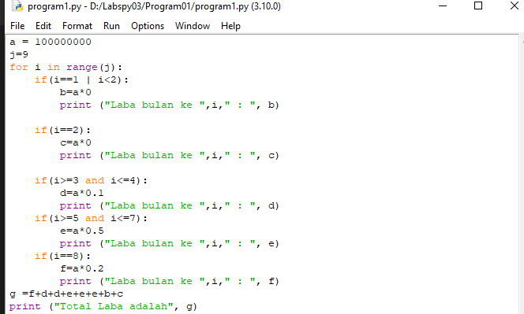

# Labspy03
## Latihan 1 (Menampilkan Bilangan Acak)

-<i>From random import random</i> untuk menambahkan penggunan module random

-disini saya menggunakan perulangan while dan for

<i>b = random()%0.5</i> digunakan untuk mencari nilai random 0.5

## Latihan 2

Untuk perulangan kali ini kita menggunakan <i>while True</i>

Masukkan variable b dengan int input setelah itu gunakan statement if jika <i>b sama dengan 0 program berhenti</i> dan jika <i>b lebih besar dari a print bilangan terbesar b</i> dan akan menghasilkan program seperti dibawah

## Program 1 (Menghitung Laba)

Disini saya menggunakan metode gabungan perulangan <i>for dan if</i>

buatlah integer untuk modal awal 100 juta dan variable untuk range.

setelah itu atur range dengan metode if untuk menghitung laba tiap bulan. Setelah itu kalian bisa menghitung keuntungan dengan menjumlahkan laba setiap bulannya. dan akan menghasilkan program seperti dibawah.

## end